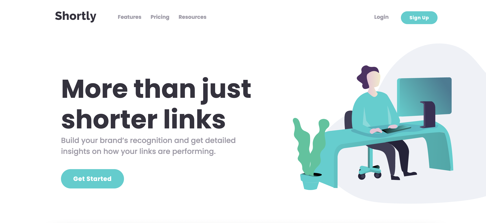

# Frontend Mentor - Shortly URL shortening API Challenge solution

This is my solution to the [Shortly URL shortening API Challenge challenge on Frontend Mentor](https://www.frontendmentor.io/challenges/url-shortening-api-landing-page-2ce3ob-G).

## Table of contents

- [Overview](#overview)
  - [The challenge](#the-challenge)
  - [Screenshot](#screenshot)
  - [Links](#links)
- [My process](#my-process)
  - [Built with](#built-with)
- [Author](#author)
- [Acknowledgments](#acknowledgments)

## Overview

### The challenge

Users should be able to:

- View the optimal layout for the site depending on their device's screen size
- Shorten any valid URL
- See a list of their shortened links, even after refreshing the browser
- Copy the shortened link to their clipboard in a single click
- Receive an error message when the `form` is submitted if:
  - The `input` field is empty

### Screenshot

### Links

- Solution URL: [Github](https://github.com/brunades/url-shortening-api-master)
- Live Site URL: [Netlify](https://url-shortening-api-brunades.netlify.app/)

## My process

### Built with

- Semantic HTML5 markup
- SASS
- Flexbox
- CSS Grid
- Mobile-first workflow
- Vanilla JS

## Author

- Github - [brunades](https://github.com/brunades)
- Frontend Mentor - [@brunades](https://www.frontendmentor.io/profile/brunades)

## Acknowledgments
Thanks to the Frontend Mentor community and Clean URI for the API. Special thanks to the browser dev tools for making debugging bearable!
